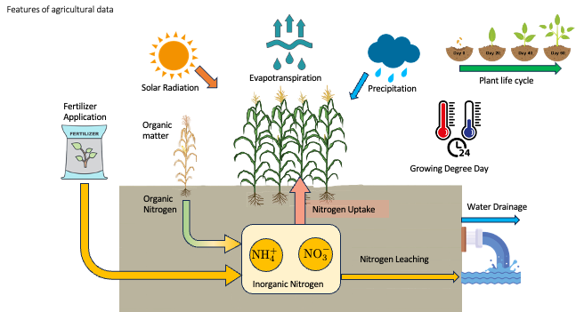
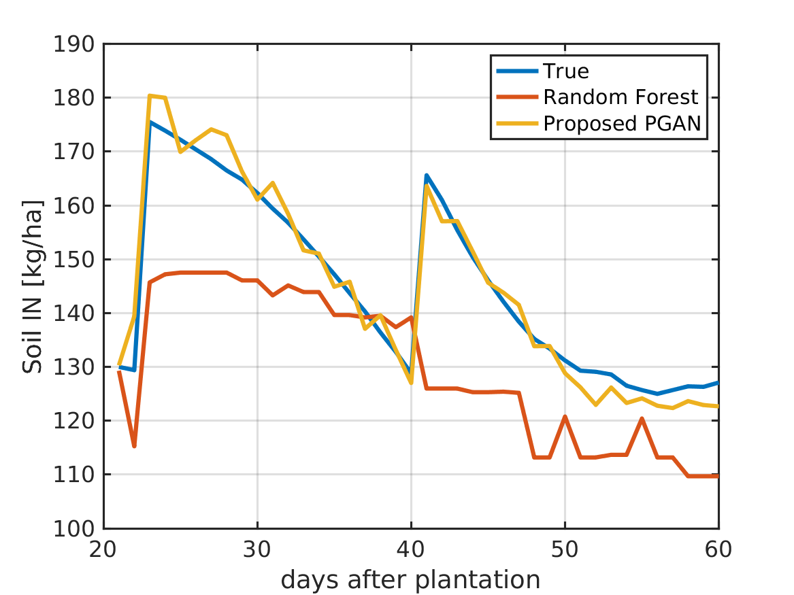
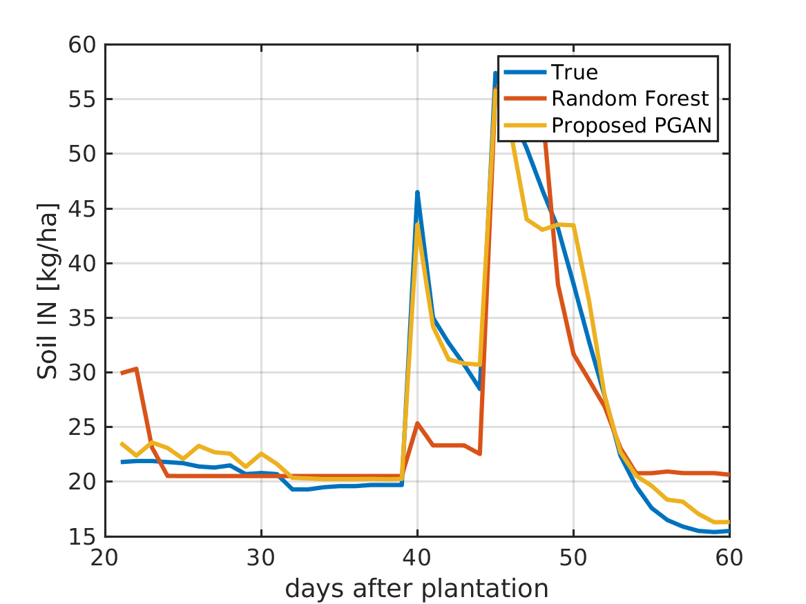
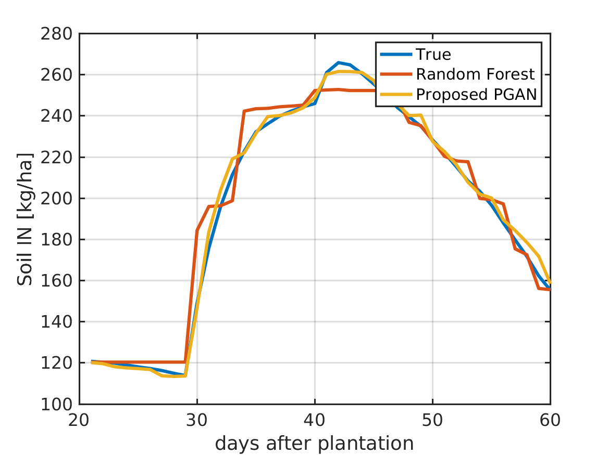

# GAN Soil Nitrogen Prediction in Precision Agriculture

 This repository contains the code for the Agricultural AI project.

## Introduction
This project aims to develop a Generative Adversarial Network (GAN) model for soil nitrogen prediction in precision agriculture. By leveraging advanced deep-learning techniques, we introduce an innovative approach to generate synthetic soil nitrogen data that can enhance the accuracy of nitrogen predictions in agricultural fields. Our GAN model is designed to learn from diverse datasets and produce high-quality synthetic data that can be used to optimize nitrogen usage and improve sustainable farming practices.

## Motivation 
Agricultrual Features |       
:-------------------------:|

Nitrogen is the key nutrient for plant growth optimization, and its availability in the soil is crucial for crop productivity. This project aims to develop a deep-learning model that can predict soil nitrogen levels for farmers and agricultural experts without the need for extensive soil experiments.

## Results
Farm site 1 | Farm site 2 | Farm site 3
:-------------------------:|:-------------------------:|:-------------------------:|
  |   | 

## License
This project is licensed under the MIT License - see the LICENSE.md file for details.

## Acknowledgments
- Special thanks to [Decision Support System for Agrotechnology Transfer (DSSAT)](https://github.com/DSSAT/dssat-csm-os/tree/v4.8.2.0) for providing the simulator to generate the dataset.
- Gratitude to all contributors who have invested their time in improving this project.
- Acknowledgment of Related Research Paper or Project that inspired this work.